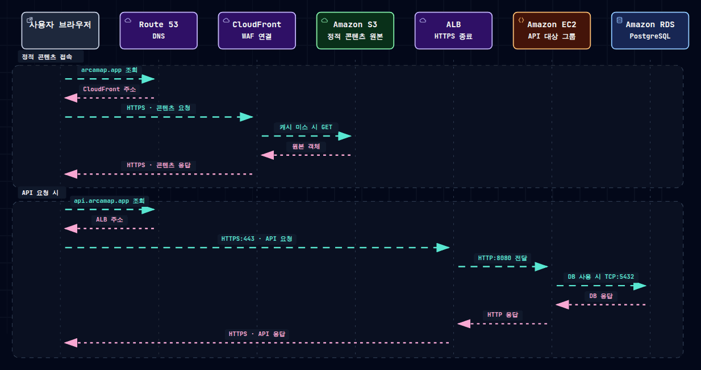

# ArcaMap

## 프로젝트 소개

ArcaMap은 전 세계의 저장소와 보존 시설을 지도에서 탐색하는 서비스입니다. 종자은행, 유전자원센터, 기록보존소 등이 무엇을 보존하고 있으며, 재난·문명 붕괴 이후 생태계와 문명의 복원에 어떤 가치를 갖는지 살펴볼 수 있습니다. 사용자는 검색과 분류·보존 유형·등급 필터를 통해 장소를 찾고, 위치와 보존 내용, 관련 정보를 확인할 수 있습니다.

ArcaMap은 Terraform 기반의 코드형 인프라(IaC)를 통해 AWS 리소스를 프로비저닝하고, 리소스의 수명 주기를 제어합니다.

## 3. 사용자 요청 흐름도

