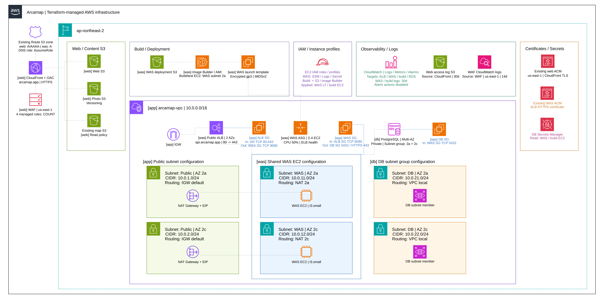

# ArcaMap <https://arcamap.app/>

**🌍전 세계의 저장소와 보존 시설을 지도에서 탐색하는 서비스**

종자은행, 유전자원센터, 기록보존소 등이 무엇을 보존하고 있으며 재난·문명 붕괴 이후 생태계와 문명의 복원에 어떤 가치가 있는지 살펴볼 수 있습니다. 장소 검색과 분류·보존 유형·등급 필터로 시설을 찾고 위치·보존 내용·관련 정보를 확인합니다.

> ℹ️ **현재 운영 중인 서비스**입니다. 애플리케이션 소스 코드는 비공개로 관리하며 이 저장소에는 **Terraform 기반의 AWS 인프라 구성과 설계·운영 문서**를 공개합니다.

[아키텍처](#1-system-architecture시스템-아키텍처) · [요청 흐름](#2-user-request-flow사용자-요청-처리-흐름) · [설계 원칙](#3-design-principles설계-원칙) · [운영 기준](#4-operational-criteria-and-constraints운영-기준-및-제약) · [Terraform 구성](#5-terraform-configurationterraform-구성)

## 1. System Architecture(시스템 아키텍처)



| 서비스 리전 | 가용 영역 | API 인스턴스 | CPU 확장 목표 | RDS 백업 보존 |
|:---:|:---:|:---:|:---:|:---:|
| 서울 | **2개** | **2~4대** | **50%** | **3일** |

ArcaMap의 인프라는 **가용성, 확장성, 접근 통제**를 중심으로 설계합니다. 여러 가용 영역에 리소스를 나누어 장애에 대비합니다. 오토 스케일링은 CPU 부하에 따라 API 처리 용량을 조절합니다. AMI로 배포해 실행 환경을 일관되게 유지하고 로그와 지표로 서비스 상태를 모니터링합니다.

### 네트워크와 접근 통제

- 🌐 **네트워크 배치** — ALB는 **퍼블릭 서브넷**에 배치합니다. API 서버와 RDS는 서로 다른 **프라이빗 서브넷**에 배치합니다. 보안 그룹으로 `ALB → API → RDS` 통신을 제한합니다.

- 🛡️ **다중 가용 영역** — ALB·API 인스턴스·NAT Gateway와 RDS 주·대기 인스턴스를 **두 가용 영역**에 분산합니다. ALB의 요청 분산, ASG의 인스턴스 자동 복구, RDS PostgreSQL의 **Multi-AZ 장애 조치**로 단일 가용 영역 장애에 대비합니다.

- 🔑 **운영 접속·인증정보** — **SSH 포트 개방 없이** AWS Systems Manager Session Manager로 접속합니다. RDS 인증정보는 **AWS Secrets Manager**에 저장하고 API 서비스가 시작할 때 조회합니다. 운영·이미지 빌드 인스턴스의 IAM 역할을 분리하며 조회 권한은 지정된 Secret으로 제한합니다.

### 콘텐츠 제공과 배포

- 📦 **정적 콘텐츠** — 웹·지도 데이터는 **S3·CloudFront**로 제공합니다. **Origin Access Control(OAC)**과 버킷 정책으로 해당 CloudFront 배포만 S3 오리진에 접근하도록 제한합니다.

- 🔍 **웹 위협 탐지** — CloudFront에 연결한 AWS WAF로 악성 IP·DDoS·웹 취약점 공격을 검사합니다. 관리형 규칙 판정은 **Count 모드**로 집계하고 로그·지표를 CloudWatch에 수집합니다.

- 🚀 **API 배포** — **EC2 Image Builder**로 API와 의존성을 포함한 AMI를 생성합니다. Terraform이 시작 템플릿에 AMI를 반영하면 **ASG Instance Refresh**가 인스턴스를 교체합니다.

## 2. User Request Flow(사용자 요청 처리 흐름)


### 정적 콘텐츠 요청

1. 브라우저가 `arcamap.app`의 **DNS를 조회**하여 CloudFront 대상 주소를 확인합니다.
2. CloudFront에 **HTTPS**로 콘텐츠를 요청합니다. 연결된 AWS WAF가 요청을 검사하고 **Count 모드**로 기록합니다.
3. **유효한 캐시가 있으면 바로 응답**합니다. **캐시 미스가 발생하면** OAC로 서명한 요청을 보내 해당 S3 오리진에서 원본을 가져옵니다.
4. CloudFront가 HTTPS로 응답하면 브라우저가 웹 화면과 지도 데이터를 표시합니다.

### API 요청

1. 브라우저가 `api.arcamap.app`의 **DNS를 조회**하여 ALB 대상 주소를 확인합니다.
2. ALB에 **`HTTPS 443`**으로 API 요청을 보냅니다.
3. ALB가 **TLS 연결을 종료**하고 대상 그룹의 EC2 API 서버에 **`HTTP 8080`**으로 전달합니다.
4. API 서버가 요청을 처리합니다. **DB 조회가 필요한 경우** RDS PostgreSQL에 **`TCP 5432`**로 연결하여 결과를 받습니다.
5. API 서버 → ALB → 브라우저 순서로 결과를 반환합니다. ALB → 브라우저 구간은 HTTPS로 응답합니다.

## 3. Design Principles(설계 원칙)

| 원칙 | 목표 |
|:---|:---|
| ⚙️ **Operational&nbsp;Excellence**<br>(운영 우수성) | 인프라 변경·AMI 배포 자동화, 로그·지표 기반 운영 상태 파악 |
| 🔒 **Security**<br>(보안) | 네트워크 격리·권한 제한을 통한 시스템·데이터 보호, 웹 위협 탐지 |
| 🛡️ **Reliability**<br>(안정성) | 다중 가용 영역·자동 장애 조치로 중단 최소화, 백업을 통한 복구 |
| ⚡ **Performance&nbsp;Efficiency**<br>(성능 효율성) | CPU 기반 수평 확장, CloudFront 캐싱으로 응답 지연·오리진 부하 감소 |
| 💰 **Cost&nbsp;Optimization**<br>(비용 최적화) | 수요 기반 자원 조절로 유휴 비용 절감, 인스턴스 수·스토리지 용량 상한 |
| 🌱 **Sustainability**<br>(지속 가능성) | 부하 감소 시 인스턴스 축소·보존 기간이 지난 로그 정리로 자원 사용·환경 영향 감소 |

## 4. Operational Criteria and Constraints(운영 기준 및 제약)

### 감지와 복구

- 🩺 **장애 대응** — **EC2 상태 검사·ALB 헬스 체크**를 기준으로 비정상 인스턴스를 교체하고 API 응답과 DB 연결을 각각 점검합니다.

- 📈 **용량 조절** — API 인스턴스는 평균 CPU **`50%`**를 목표로 **`2~4대`** 범위에서 조절합니다. RDS 스토리지는 지정된 상한 내에서 자동 확장합니다.

- 💾 **데이터 복구** — RDS 자동 백업을 **3일간 보존**합니다. **삭제 보호**를 설정하고 삭제할 때는 **최종 스냅샷**을 남깁니다. 오삭제나 잘못된 변경으로 손상된 데이터는 백업·스냅샷으로 복구합니다.

- ✅ **배포 확인** — **Instance Refresh 완료 후** 서비스 등록 상태·ALB 헬스 체크·API 응답·RDS 연결을 확인합니다.

### 모니터링

| 대상 | 수집·분석 위치 |
|---|---|
| 인스턴스 상태·HTTP 5xx·CPU·메모리·스토리지 지표 | CloudWatch |
| 인프라 로그 | CloudWatch Logs |
| CloudFront 접근 로그 | S3 |

API 프로세스 로그를 함께 활용해 장애 원인을 분석합니다.

### ⚠️ 제약 조건

> **배포 제약**: Terraform이 새로 생성된 AMI를 참조하면 인스턴스가 자동으로 교체됩니다. 현재 교체 정책에서는 정상 인스턴스가 유지되지 않을 수 있어 **API가 중단될 수 있습니다**.
>
> **알림 제약**: CloudWatch 경보가 **운영자에게 알림을 보내도록 설정하지는 않았습니다**.

## 5. Terraform Configuration(Terraform 구성)

Terraform 기반의 코드형 인프라(IaC)로 AWS 리소스를 프로비저닝하고 수명 주기를 제어합니다.

```text
terraform/
├── env/                         # 관리 대상별 루트 모듈
│   ├── app/                     # 공통 네트워크·보안 그룹
│   ├── db/                      # RDS·데이터베이스 로그·경보
│   ├── was/                     # API 서버·AMI 배포·IAM·ALB
│   └── web/                     # 정적 콘텐츠·CDN·웹 DNS
└── modules/                     # 역할별 하위 모듈
    ├── network/                 # VPC·서브넷·라우팅·IGW·NAT
    ├── security/                # ALB·API·DB 보안 그룹
    ├── alb/                     # 로드 밸런서·리스너·대상 그룹
    ├── compute/                 # 시작 템플릿·ASG
    ├── database/                # RDS·DB 서브넷 그룹
    ├── image-builder/           # 이미지 빌드·테스트·AMI 생성
    ├── s3-bucket/               # S3 버킷·암호화·수명 주기
    ├── cloudfront/              # CloudFront·OAC·WAF
    ├── cloudwatch-log-group/    # 로그 그룹·보존 기간
    └── cloudwatch-alarm/        # 지표 기반 경보
```
