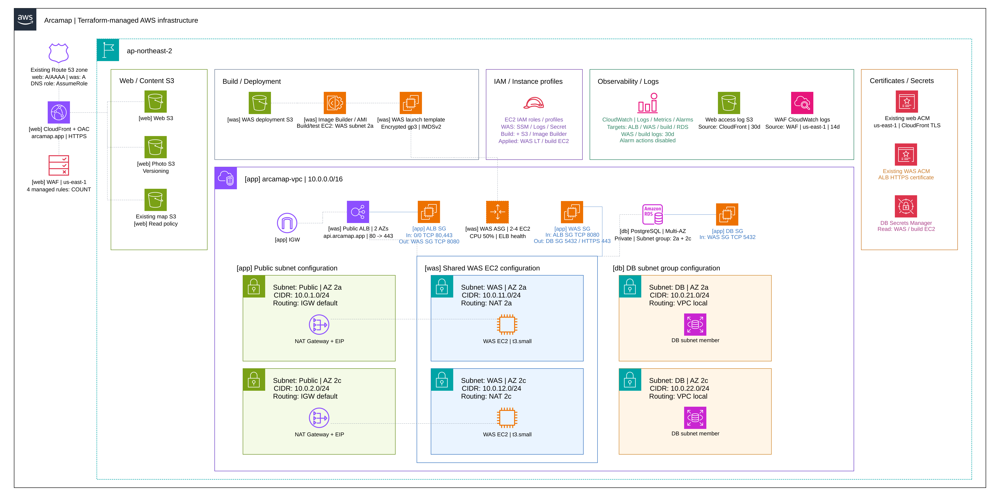
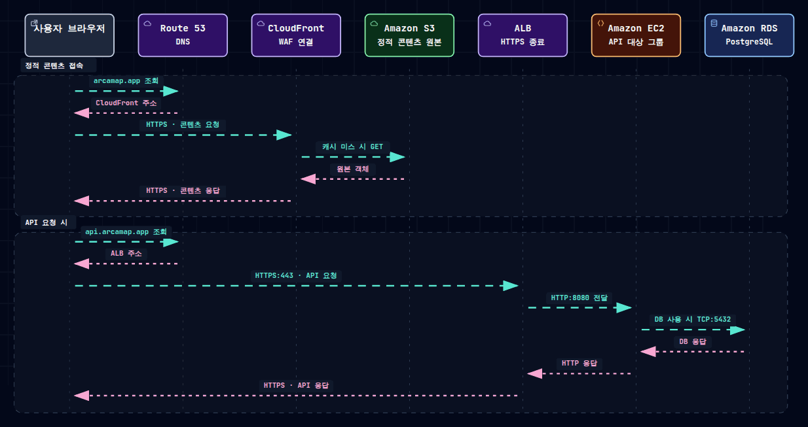

#  ArcaMap <https://arcamap.app/>

**전 세계의 저장소와 보존 시설을 지도에서 탐색하는 서비스**

> 운영 기간 (KST): 2026-09-14 ~ 2026-09-22

종자은행, 유전자원센터, 기록보존소 등이 무엇을 보존하고 있으며 재난·문명 붕괴 이후 생태계와 문명의 복원에 어떤 가치가 있는지 살펴볼 수 있습니다. 장소 검색과 분류·보존 유형·등급 필터로 시설을 찾고 위치·보존 내용·관련 정보를 확인합니다.

[아키텍처](#1-system-architecture시스템-아키텍처) · [요청 흐름](#2-user-request-flow사용자-요청-처리-흐름) · [설계 원칙](#3-design-principles설계-원칙) · [운영 기준](#4-operational-criteria-and-constraints운영-기준-및-제약) · [Terraform 구성](#5-terraform-infrastructureterraform-인프라-구성)

## 1. System Architecture(시스템 아키텍처)



| 서비스 리전 | 가용 영역 | API 인스턴스 | CPU 확장 목표 | RDS 백업 보존 |
|:---:|:---:|:---:|:---:|:---:|
| 서울 | 2개 | 2~4대 | 50% | 3일 |

ArcaMap의 인프라는 가용성, 확장성, 접근 통제를 중심으로 설계합니다. 여러 가용 영역에 리소스를 나누어 장애에 대비합니다. 오토 스케일링은 CPU 부하에 따라 API 처리 용량을 조절합니다. AMI로 배포해 실행 환경을 일관되게 유지하고 로그와 지표로 서비스 상태를 모니터링합니다.

### 네트워크와 접근 통제

- **네트워크 배치** — ALB는 퍼블릭 서브넷에 배치합니다. API 서버와 RDS는 서로 다른 프라이빗 서브넷에 배치합니다. 보안 그룹으로 `ALB → API → RDS` 통신을 제한합니다.

- **다중 가용 영역** — ALB·API 인스턴스·NAT Gateway와 RDS 주·대기 인스턴스를 두 가용 영역에 분산합니다. ALB의 요청 분산, ASG의 인스턴스 자동 복구, RDS PostgreSQL의 Multi-AZ 장애 조치로 단일 가용 영역 장애에 대비합니다.

- **운영 접속·인증정보** — SSH 포트 개방 없이 AWS Systems Manager Session Manager로 접속합니다. RDS 인증정보는 AWS Secrets Manager에 저장하고 API 서비스가 시작할 때 조회합니다. 운영·이미지 빌드 인스턴스의 IAM 역할을 분리하며 조회 권한은 지정된 Secret으로 제한합니다.

### 콘텐츠 제공과 배포

- **정적 콘텐츠** — 웹·지도 데이터는 S3·CloudFront로 제공합니다. Origin Access Control(OAC)과 버킷 정책으로 해당 CloudFront 배포만 S3 오리진에 접근하도록 제한합니다.

- **웹 위협 탐지** — CloudFront에 연결한 AWS WAF로 악성 IP·DDoS·웹 취약점 공격을 검사합니다. 관리형 규칙 판정은 Count 모드로 집계하고 로그·지표를 CloudWatch에 수집합니다.

- **API 배포** — EC2 Image Builder로 API와 의존성을 포함한 AMI를 생성합니다. Terraform이 시작 템플릿에 AMI를 반영하면 ASG Instance Refresh가 인스턴스를 교체합니다.

## 2. User Request Flow(사용자 요청 처리 흐름)



### 정적 콘텐츠 요청

1. 브라우저가 `arcamap.app`의 DNS를 조회하여 CloudFront 대상 주소를 확인합니다.
2. CloudFront에 HTTPS로 콘텐츠를 요청합니다. 연결된 AWS WAF가 요청을 검사하고 Count 모드로 기록합니다.
3. 유효한 캐시가 있으면 바로 응답합니다. 캐시 미스가 발생하면 OAC로 서명한 요청을 보내 해당 S3 오리진에서 원본을 가져옵니다.
4. CloudFront가 HTTPS로 응답하면 브라우저가 웹 화면과 지도 데이터를 표시합니다.

### API 요청

1. 브라우저가 `api.arcamap.app`의 DNS를 조회하여 ALB 대상 주소를 확인합니다.
2. ALB에 `HTTPS 443`으로 API 요청을 보냅니다.
3. ALB가 TLS 연결을 종료하고 대상 그룹의 EC2 API 서버에 `HTTP 8080`으로 전달합니다.
4. API 서버가 요청을 처리합니다. DB 조회가 필요한 경우 RDS PostgreSQL에 `TCP 5432`로 연결하여 결과를 받습니다.
5. API 서버 → ALB → 브라우저 순서로 결과를 반환합니다. ALB → 브라우저 구간은 HTTPS로 응답합니다.

## 3. Design Principles(설계 원칙)

| 원칙 | 목표 |
|:---|:---|
| Operational&nbsp;Excellence<br>(운영 우수성) | 인프라 변경·AMI 배포 자동화, 로그·지표 기반 운영 상태 파악 |
| Security<br>(보안) | 네트워크 격리·권한 제한을 통한 시스템·데이터 보호, 웹 위협 탐지 |
| Reliability<br>(안정성) | 다중 가용 영역·자동 장애 조치로 중단 최소화, 백업을 통한 복구 |
| Performance&nbsp;Efficiency<br>(성능 효율성) | CPU 기반 수평 확장, CloudFront 캐싱으로 응답 지연·오리진 부하 감소 |
| Cost&nbsp;Optimization<br>(비용 최적화) | 수요 기반 자원 조절로 유휴 비용 절감, 인스턴스 수·스토리지 용량 상한 |
| Sustainability<br>(지속 가능성) | 부하 감소 시 인스턴스 축소·보존 기간이 지난 로그 정리로 자원 사용·환경 영향 감소 |

## 4. Operational Criteria and Constraints(운영 기준 및 제약)

### 감지와 복구

- **장애 대응** — EC2 상태 검사·ALB 헬스 체크를 기준으로 비정상 인스턴스를 교체하고 API 응답과 DB 연결을 각각 점검합니다.

- **용량 조절** — API 인스턴스는 평균 CPU `50%`를 목표로 `2~4대` 범위에서 조절합니다. RDS 스토리지는 지정된 상한 내에서 자동 확장합니다.

- **데이터 복구** — RDS 자동 백업을 3일간 보존합니다. 삭제 보호를 설정하고 삭제할 때는 최종 스냅샷을 남깁니다. 오삭제나 잘못된 변경으로 손상된 데이터는 백업·스냅샷으로 복구합니다.

- **배포 확인** — Instance Refresh 완료 후 서비스 등록 상태·ALB 헬스 체크·API 응답·RDS 연결을 확인합니다.

### 모니터링

| 대상 | 수집·분석 위치 |
|---|---|
| 인스턴스 상태·HTTP 5xx·CPU·메모리·스토리지 지표 | CloudWatch |
| 인프라 로그 | CloudWatch Logs |
| CloudFront 접근 로그 | S3 |

API 프로세스 로그를 함께 활용해 장애 원인을 분석합니다.

### 제약 조건

> **교체 정책**: 새 AMI를 반영할 때 Instance Refresh가 최소 정상 비율 100%, 최대 용량 비율 200%로 새 서버를 먼저 준비한 뒤 기존 서버를 종료하도록 구성했습니다. AWS 적용 및 무중단 검증은 아직 수행하지 않았습니다.
>
> **알림 제약**: CloudWatch 경보가 운영자에게 알림을 보내도록 설정하지는 않았습니다.

## 5. Terraform Infrastructure(Terraform 인프라 구성)

**ArcaMap의 네트워크·데이터 저장·API·콘텐츠 제공을 구성하는 AWS 인프라**

인프라는 관리 대상별로 루트 모듈을 나누고 각 역할은 하위 모듈로 구현합니다. 네트워크와 접근 통제는 공통 기반으로 두고 데이터베이스·API 서버·정적 콘텐츠는 따로 관리합니다.

### 5.1. Infrastructure Composition(인프라 구성)

| 공통 기반 | 데이터 저장 | API 처리 | 정적 콘텐츠 | 통합 모니터링 |
|:---:|:---:|:---:|:---:|:---:|
| network | database | api | frontend | monitoring |

- **공통 기반** — VPC·서브넷·라우팅으로 리소스를 배치하고 보안 그룹으로 통신 범위를 정합니다.

- **데이터 저장** — RDS PostgreSQL을 프라이빗 서브넷에 배치하고 로그·경보를 통해 데이터베이스 상태를 파악합니다.

- **API 처리** — ALB가 요청을 API 서버로 전달합니다. 인스턴스는 AMI로 생성하고 오토 스케일링으로 수를 조절합니다.

- **정적 콘텐츠** — S3에 저장한 웹·지도·사진 콘텐츠를 CloudFront로 제공하고 OAC와 버킷 정책으로 오리진 접근을 제한합니다.

### 5.2. Component Relationships(구성 요소 간 관계)

#### API 처리 경로

1. ALB가 클라이언트의 HTTPS 요청을 받습니다.
2. 대상 그룹의 API 서버로 요청을 전달합니다.
3. 데이터 조회가 필요한 경우 API 서버가 RDS PostgreSQL에 연결합니다.
4. 처리 결과가 API 서버와 ALB를 거쳐 클라이언트로 반환됩니다.

#### 정적 콘텐츠 제공 경로

1. CloudFront에 연결된 WAF가 콘텐츠 요청을 검사합니다.
2. 유효한 캐시가 있으면 CloudFront가 바로 응답합니다.
3. 캐시 미스가 발생하면 OAC로 서명한 요청으로 S3 오리진의 콘텐츠를 가져옵니다.

### 5.3. Design Principles(설계 원칙)

| 원칙 | 구성에 반영한 방식 |
|---|---|
| 역할 분리 | 네트워크·DB·API·웹 콘텐츠의 관리 범위를 루트 모듈로 구분합니다. |
| 접근 통제 | 보안 그룹과 IAM 권한으로 통신·리소스 접근 범위를 제한합니다. |
| 가용성 | 두 가용 영역에 주요 리소스를 배치하고 장애에 대응할 기능을 갖춥니다. |
| 운영 가시성 | 로그와 지표 기반 경보로 리소스 상태를 파악합니다. |

### 5.4. Terraform Configuration(Terraform 구성)

```text
arcamap/
├── env/                         # 관리 대상별 루트 모듈
│   ├── network/                 # 공통 네트워크·보안 그룹
│   ├── database/                # RDS·데이터베이스 로그·경보
│   ├── api/                     # API 서버·AMI 배포·IAM·ALB·WAF
│   ├── frontend/                # 정적 콘텐츠·CDN·WAF·웹 DNS
│   └── monitoring/              # 통합 지표·경보·로그 대시보드
└── modules/                     # 역할별 하위 모듈
    ├── network/                 # VPC·서브넷·라우팅·IGW·NAT
    ├── security/                # ALB·API·DB 보안 그룹
    ├── alb/                     # 로드 밸런서·리스너·대상 그룹·WAF·로그
    ├── compute/                 # 시작 템플릿·ASG
    ├── database/                # RDS·DB 서브넷 그룹
    ├── image-builder/           # 이미지 빌드·테스트·AMI 생성
    ├── s3-bucket/               # S3 버킷·암호화·수명 주기
    ├── cloudfront/              # CloudFront·OAC·캐시·WAF·로그·접근 정책
    ├── cloudwatch-log-group/    # 로그 그룹·보존 기간
    ├── cloudwatch-alarm/        # 지표 기반 경보
    └── cloudwatch-dashboard/    # 통합 대시보드
```

각 루트의 파일 역할과 배포 의존 관계는 [실행 구성 안내](env/README.md), 리소스별 코드 위치는 [모듈 안내](modules/README.md)에서 확인할 수 있습니다.
