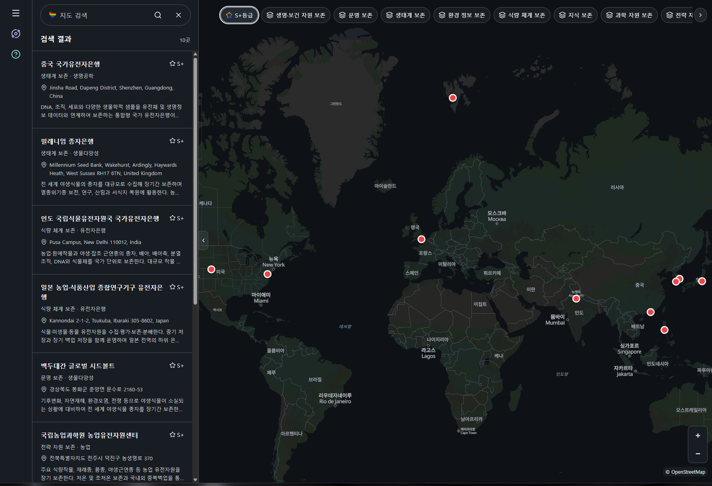
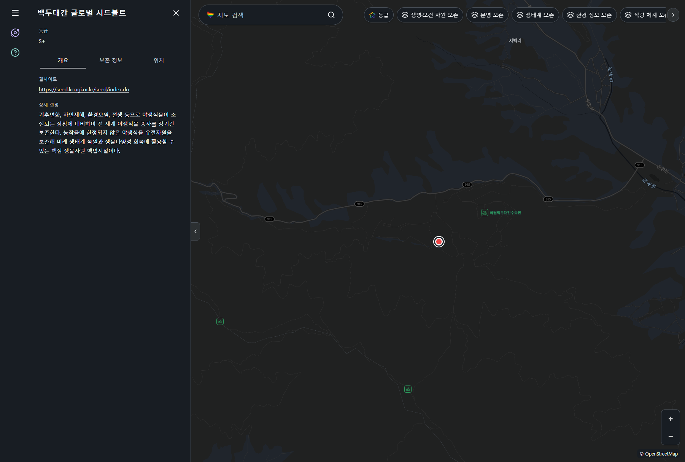
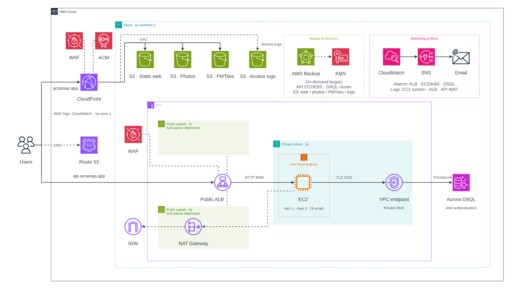

#  ArcaMap(https://arcamap.app/)

<table>
  <tr>
    <td width="50%" valign="top"></td>
    <td width="50%" valign="top"></td>
  </tr>
</table>

ArcaMap은 전 세계의 저장소와 보존 시설을 지도에서 탐색하는 서비스입니다.
장소를 검색하거나 분류·보존 유형·등급으로 찾아볼 수 있습니다. 장소를 선택하면 위치, 주소, 설명과 보존 정보를 확인하실 수 있습니다.

> 2차 운영 기간: 2026-10-4~

## 1. 인프라 구성



| 구분 | 구성 |
|---|---|
| 기본 리전 | 서울 `ap-northeast-2` |
| 네트워크 | VPC `10.0.0.0/16`, 공개 서브넷 2개, 사설 서브넷 1개, NAT Gateway 1개 |
| API 진입점 | 공개 ALB, HTTPS, WAF |
| API 인스턴스 | `t3.small`, 암호화한 루트 볼륨 20GiB, ASG 최소 1대·최대 2대 |
| 용량 조정 | 평균 CPU 50%, 평균 메모리 사용률 50% 목표 |
| 데이터베이스 | Aurora DSQL, VPC 엔드포인트, IAM 인증 |
| 콘텐츠 전달 | S3, CloudFront, OAC, WAF |
| AMI 관리 | EC2 Image Builder와 AMI 수명 주기 정책 |
| 모니터링 | CloudWatch 로그·경보·대시보드, SNS 이메일 알림 |
| 백업 | AWS Backup 볼트, KMS 키와 백업·복원 IAM 역할 |

공개 ALB는 `ap-northeast-2a`와 `ap-northeast-2c`의 공개 서브넷을 사용합니다. API 인스턴스와 DSQL VPC 엔드포인트는 `ap-northeast-2a`의 사설 서브넷을 사용합니다. 이 서브넷의 외부 통신은 같은 가용 영역의 NAT Gateway를 거칩니다.

## 2. 요청 경로

웹 요청은 CloudFront WAF를 거쳐 캐시로 전달됩니다. CloudFront는 원본 조회가 필요할 때 OAC로 서명한 요청을 S3로 보냅니다.

| 콘텐츠 경로 | 원본 | 기본·최대 캐시 TTL |
|---|---|---|
| 기본 경로 | 정적 파일 S3 | 300초 |
| `/assets/*` | 정적 파일 S3 | 31,536,000초 |
| `/photos/*` | 사진 S3 | 86,400초 |
| `/20260907.pmtiles` | 지도 S3의 해당 객체 | 86,400초 |

API 요청은 `api.arcamap.app`의 ALB로 전달됩니다. ALB는 HTTPS `443` 요청을 받아 사설 인스턴스의 HTTP `8080`으로 전달합니다. API 인스턴스는 IAM 인증과 TLS를 사용하여 DSQL VPC 엔드포인트의 TCP `5432`로 접속합니다.

ALB는 `/health`로 대상 상태를 검사합니다. API WAF는 `/health/db`와 `/health/db/` 경로를 차단합니다. API와 CloudFront WAF는 IP 평판, 공통 규칙과 알려진 악성 입력 규칙 그룹을 적용합니다.

## 3. 로그와 알림

| 항목 | 설정 |
|---|---|
| 시스템·ALB·Image Builder 로그 | CloudWatch Logs, 30일 보존 |
| API·CloudFront WAF 로그 | CloudWatch Logs, 14일 보존 |
| CloudFront 접근 로그 | S3, 현재 객체 30일 후 만료·이전 버전 7일 보존 |
| 서비스 경보 | API 경보 7개, DSQL 연결 수 경보 1개 |
| SNS 토픽 | `arcamap-operations` |
| CloudWatch 대시보드 | `arcamap-operations`, 기본 조회 범위 최근 7일 |

모든 서비스 경보는 `ALARM`, `OK`, `INSUFFICIENT_DATA` 상태 전환을 SNS로 알립니다. 대시보드는 ASG·EC2·ALB·WAF·DSQL 지표와 로그를 함께 표시합니다.

## 4. 저장소와 백업

정적 파일, 사진, 지도, CloudFront 로그와 배포 파일은 S3 버킷 5개에 저장합니다. 각 버킷은 퍼블릭 액세스 차단, 기본 암호화와 버전 관리를 사용합니다. 이전 객체 버전의 보존 기간은 7일입니다.

온디맨드 백업 대상은 DSQL 클러스터, API EC2와 S3 버킷 5개입니다. 서울 리전의 `arcamap-backup` 볼트와 전용 KMS 키를 사용하며 백업·복원 권한은 각각의 IAM 역할로 관리합니다.

## 5. Terraform 폴더 구조

```text
v2/
├── env/
│   ├── network/                 # VPC, 서브넷, 라우팅, 보안 그룹, SNS
│   ├── database/                # Aurora DSQL, VPC 엔드포인트, 연결 수 경보
│   ├── api/                     # ALB, ASG, IAM, Image Builder, 로그·경보
│   ├── frontend/                # S3, CloudFront, WAF, DNS
│   ├── monitoring/              # 통합 CloudWatch 대시보드
│   ├── bootstrap/               # DSQL 관리용 임시 EC2와 전용 IAM 역할
│   ├── backup/                  # 백업 볼트, KMS, 백업·복원 IAM 역할
│   └── README.md
├── modules/
│   ├── network/                 # VPC, 서브넷, 게이트웨이, 라우팅
│   ├── security/                # 보안 그룹과 통신 규칙
│   ├── database/                # Aurora DSQL과 VPC 엔드포인트
│   ├── alb/                     # ALB, API WAF, 로그
│   ├── compute/                 # 시작 템플릿, ASG, 용량 조정, 인스턴스 교체
│   ├── image-builder/           # Image Builder와 AMI 수명 주기
│   ├── s3-bucket/               # S3 버킷과 보존 설정
│   ├── cloudfront/              # CloudFront, OAC, 캐시, WAF, 로그
│   ├── cloudwatch-log-group/    # 로그 그룹과 보존 기간
│   ├── cloudwatch-alarm/        # 지표 경보와 SNS 알림 연결
│   ├── cloudwatch-dashboard/    # 지표·로그·경보 대시보드
│   └── README.md
└── README.md
```

## 6. 인프라 문서

| 경로 | 내용 |
|---|---|
| [env](env/README.md) | 환경별 역할, 입력 연결, 임시 관리 환경과 백업 |
| [env/network](env/network/README.md) | VPC, 라우팅, 보안 그룹과 알림 |
| [env/database](env/database/README.md) | DSQL, VPC 엔드포인트와 연결 수 경보 |
| [env/api](env/api/README.md) | ALB, 인스턴스, IAM, 이미지와 로그·경보 |
| [env/frontend](env/frontend/README.md) | 콘텐츠 저장소, CloudFront, WAF와 DNS |
| [env/monitoring](env/monitoring/README.md) | 통합 대시보드 |
| [modules](modules/README.md) | 공통 Terraform 모듈 11개 |
